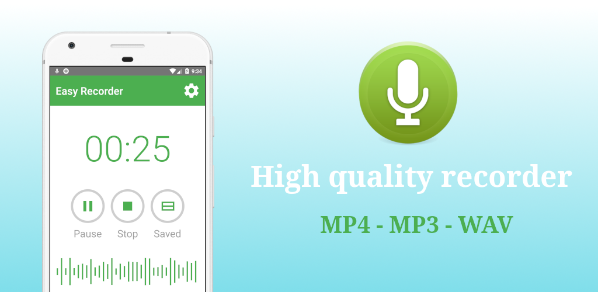
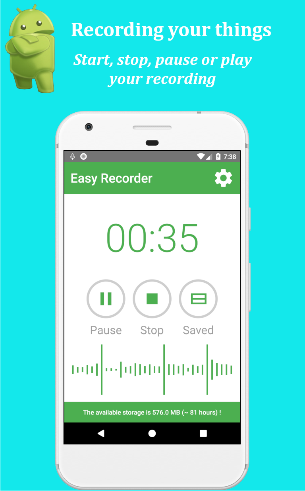

# Easy-Recorder-Android

<b>Recorder software (Easy Recorder)</b>

It's is totally free, simple, and easy to use but no less beautiful. It can be used to record your meeting, personal notes, speeches, lectures, songs, interview, day to day sounds, especially your moments. It supports many languages for many countries and regions, so everyone can use it. This application is a good choice.

<b>What makes us better than other recorder software on the market?</b>

<b>Features:</b>

• It's very lite in size and best performance.

• It's very nice and easy to use.

• It supports many languages in the world.

• It has full features for voice recording.

<b>What makes us better than the default recorder software?</b>

<b>Features:</b>

• Support language: English, Russian, Chinese, Japanese, Vietnamese, Indian, French, etc.

• Record voice with high quality.

• There is no time limit.

• The simple user interface, easy to use.

• Format file: MP4 - MP3 - WAV.

• Play, pause, resume, stop recording.

• Play, pause, resume, stop record audio file.

• Send/Share your recording via Line, Zalo, email, etc.

• Delete your recording: Delete files one by one; Delete multiple files at once.

• Edit the name of your recording.

• Support to visualize and analyze audio when you are recording - the Live audio spectrum analyzer.

• Set your recording as a ringtone on your phone.

• Search your recordings by name.

• Recording in the background without turning on the phone screen.

• Count the number of recording files and their size.

• Estimate the remaining memory and time for recording.

• Optionally change the default recording filename before recording.

• Dynamically change your saving location of files.

• Synchronize to add your existing recording files to the application.

• Especially, you can change themes for the app.

I hope you love and enjoy this application.
# Screen shots

# Download on Google play
[Download here](https://play.google.com/store/apps/details?id=thuongngo.easyrecorder)
